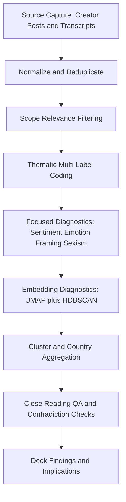
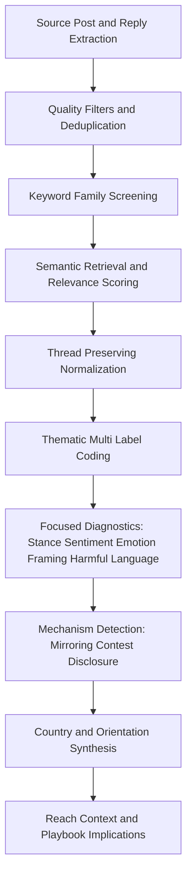
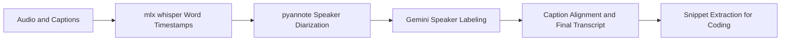

# Deck Mermaid Flowcharts

## Content Pipeline

```mermaid
flowchart TD
    A[Source Capture: Creator Posts and Transcripts] --> B[Normalize and Deduplicate]
    B --> C[Scope Relevance Filtering]
    C --> D[Thematic Multi Label Coding]
    D --> E[Focused Diagnostics: Sentiment Emotion Framing Sexism]
    E --> F[Embedding Diagnostics: UMAP plus HDBSCAN]
    F --> G[Cluster and Country Aggregation]
    G --> H[Close Reading QA and Contradiction Checks]
    H --> I[Deck Findings and Implications]
```

## Audience Pipeline

```mermaid
flowchart TD
    A1[Source Post and Reply Extraction] --> B1[Quality Filters and Deduplication]
    B1 --> C1[Keyword Family Screening]
    C1 --> D1[Semantic Retrieval and Relevance Scoring]
    D1 --> E1[Thread Preserving Normalization]
    E1 --> F1[Thematic Multi Label Coding]
    F1 --> G1[Focused Diagnostics: Stance Sentiment Emotion Framing Harmful Language]
    G1 --> H1[Mechanism Detection: Mirroring Contest Disclosure]
    H1 --> I1[Country and Orientation Synthesis]
    I1 --> J1[Reach Context and Playbook Implications]
```

## Transcription and Content Preparation

```mermaid
flowchart LR
    T1[Audio and Captions] --> T2[mlx whisper Word Timestamps]
    T2 --> T3[pyannote Speaker Diarization]
    T3 --> T4[Gemini Speaker Labeling]
    T4 --> T5[Caption Alignment and Final Transcript]
    T5 --> T6[Snippet Extraction for Coding]
```
