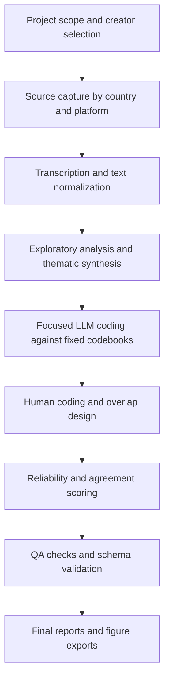
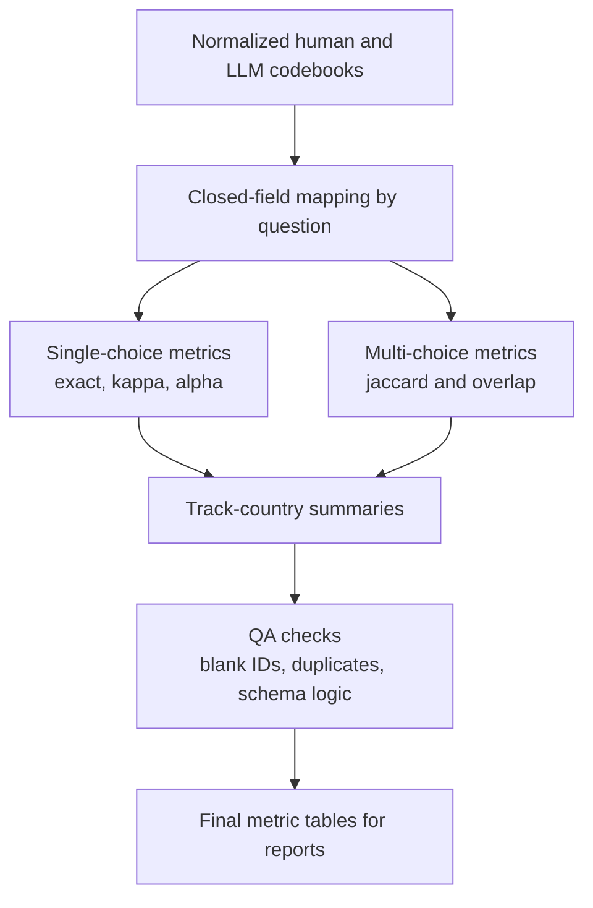

# Gates Foundation Masculinity Influencer Study

Production repository for the Norman Lear Center (USC) analysis of masculinity influencer content and audience reception in Nigeria and Kenya.

## Project Purpose

This repository supports two linked analytical tracks:

1. Content analysis of masculinity-focused creator outputs.
2. Audience reception analysis of public comments responding to that content.

The project combines exploratory analysis and focused structured coding with human validation and reliability scoring.

## Final Deliverables

Primary report deliverables are in:

- `Research Assets/Deliverables/Content Analysis Report - Nigeria and Kenya.docx`
- `Research Assets/Deliverables/Audience Reception Report - Nigeria and Kenya.docx`

High-resolution figure exports are in:

- `Figures/Figures/High Resolution Exports Complete/`
- `Research Assets/Deliverables/Figures/`

## Repository Layout

- `Codebooks/`
  - `Human Codebooks/` final human coding workbooks.
  - `LLM Codebook/` final LLM coding outputs.
  - `Master Codebooks - Human/` consolidated master and reliability files.
- `Nigeria/`
  - Country-specific content and audience data, scripts, notebooks, and outputs.
- `Kenya/`
  - Country-specific content and audience data, scripts, notebooks, and outputs.
- `scripts/`
  - Cross-country pipeline scripts and shared outputs.
- `Notebooks/`
  - Project-level notebooks for reliability, agreement, and normalization workflows.
- `Figures/`
  - Report visuals, pipeline figures, high-resolution exports, and deck-ready assets.
- `Research Assets/`
  - Scope docs, methodology notes, and final reporting package.

## Environment Setup

```bash
python -m venv .venv
source .venv/bin/activate
pip install -r requirements.txt
```

Core dependencies used in active workflows:

- `pandas`
- `openpyxl`
- `python-docx`
- `krippendorff`
- `matplotlib`
- `seaborn`

## End-to-End Pipeline



## Content Analysis Pipeline

```mermaid
flowchart LR
    A["Creator content sources"] --> B["Country ingestion\nNigeria and Kenya"]
    B --> C["Transcription and segmentation"]
    C --> D["Snippet-level schema standardization"]
    D --> E["Exploratory coding\nsentiment, themes, framing"]
    E --> F["Focused structured coding\nfinal content codebook"]
    F --> G["Human overlap coding\npairwise + all-coder"]
    G --> H["Metrics\nexact, kappa, alpha, jaccard, F1"]
    H --> I["Content report outputs"]
```



## Audience Analysis Pipeline

```mermaid
flowchart LR
    A["Audience comments and replies"] --> B["Keyword and relevance filtering"]
    B --> C["Language normalization and cleanup"]
    C --> D["Exploratory audience analysis"]
    D --> E["Focused structured coding\nfinal audience codebook"]
    E --> F["Human validation sample\nmaster + IRR workbooks"]
    F --> G["Agreement and reliability scoring"]
    G --> H["Audience report outputs"]
```



## Reliability and QA Workflow



## Active Scripts (Renamed and Standardized)

### Cross-country

- `scripts/unifiedEdaBothCountries.py`
  - Runs unified exploratory analysis for Nigeria and Kenya content.
  - Outputs Excel workbooks to `scripts/eda_output/`.

### Kenya filtering

- `Kenya/scripts/filtering/kenyaAudienceFilterPipeline.py`
  - Corpus-level Kenya audience filter.
  - Writes only Excel outputs.
- `Kenya/scripts/filtering/runPiecewiseAudienceFilter.py`
  - Runs per-piece filtering for all configured Kenya files.
  - Writes only Excel outputs.
- `Kenya/scripts/filtering/audienceRelevanceFilterPiecewise.py`
  - Single-input piecewise relevance filter.
  - Writes only Excel outputs.

### Kenya transcription

- `Kenya/scripts/transcription/main.py`
  - Full transcription pipeline entry point.
- `Kenya/scripts/transcription/writers.py`
  - Transcript and segment writers.
  - Segment outputs are Excel workbooks.

### Kenya reliability and agreement

- `Kenya/scripts/llm_coding/scoreCodebookAlpha.py`
  - Human vs LLM agreement scoring to Excel outputs.
- `Kenya/scripts/llm_coding/calculateFairAgreement.py`
  - Strict and conditional agreement scoring to Excel outputs.
- `Kenya/scripts/llm_coding/normalizeCodebookAgreementFiles.py`
  - Normalization utility that writes normalized workbooks in Excel format.

## Output Format Policy

All active tabular outputs in maintained scripts are standardized to Excel (`.xlsx`).

CSV may still appear as accepted input in selected legacy-compatible readers, but maintained pipelines now write report artifacts in Excel format only.

## Operational Notes

- Do not edit archive materials unless explicitly required.
- Final report figures should be exported from high-resolution sources for DOCX and slide use.
- Keep codebook labels canonical and preserve conditional logic rules.
- Treat open-text fields as qualitative context, not closed-field reliability metrics.

## Maintainer Handoff

For fast onboarding:

1. Read `Research Assets/Project Scope/` for sampling logic and constraints.
2. Review `Codebooks/` final human and LLM workbooks.
3. Run country scripts from `Kenya/scripts/` and `Nigeria/scripts/` as needed.
4. Use `Notebooks/` for reconciliation and reliability checks.
5. Package report figures from `Figures/` high-resolution folders.

