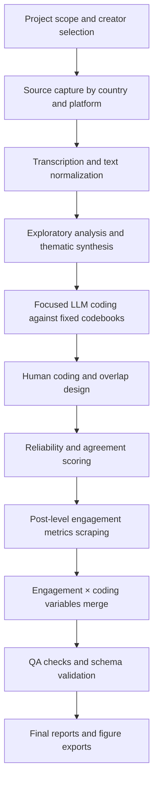
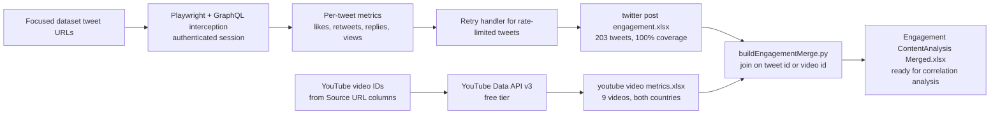

# Gates Foundation Masculinity Influencer Study

Production repository for the Norman Lear Center (USC) analysis of masculinity influencer content and audience reception in Nigeria and Kenya.

---

## Project Purpose

This repository supports two linked analytical tracks:

1. **Content analysis** — structured coding of masculinity-focused creator outputs across themes, framing, sentiment, emotion, and misogyny.
2. **Audience reception analysis** — structured coding of public comments responding to that content, plus post-level engagement metrics.

The project combines exploratory LLM analysis with focused human validation, reliability scoring, and engagement correlation.

---

## Final Deliverables

| Document | Location |
|---|---|
| Content Analysis Report | `Research Assets/Deliverables/Content Analysis Report.docx` |
| Audience Reception Report | `Research Assets/Deliverables/Audience Analysis Report.docx` |
| High-res figures | `Figures/Figures/High Resolution Exports Complete/` |
| Engagement metrics | `Research Assets/Engagement Metrics/` |

---

## Engagement Metrics (New)

Post-level engagement data has been scraped and merged with content analysis coding variables. All data lives in `Research Assets/Engagement Metrics/`.

### Nigeria — Twitter (203 tweets, 100% coverage)

Scraped via Playwright + Twitter GraphQL interception (authenticated session, no API cost).

| Creator | Tweets | Max Likes | Max Views |
|---|---|---|---|
| Shola | 72 | 9,170 | 1,018,516 |
| Agba John Doe | 52 | 4,580 | 335,821 |
| Wizarab | 53 | 1,170 | 803,077 |
| Deyemi Okanlawon | 26 | 228 | 10,166 |

### YouTube (9 videos, 100% coverage)

Scraped via YouTube Data API v3 (free tier).

| Video | Country | Views | Likes |
|---|---|---|---|
| Masculinity + Money (MENtality) | Nigeria | 252,060 | 7,905 |
| Masculinity + Relationships (MENtality) | Nigeria | 134,233 | 4,301 |
| Episode 1: A Girl Dad on a Mission | Kenya | 109,792 | 2,883 |
| Pt 2 Masculinity + Relationships | Nigeria | 86,093 | 2,734 |
| Undoing My Father's Damage | Kenya | 52,299 | 939 |
| My Voice Was Beaten Out of Me | Kenya | 36,495 | 676 |

### Merged Analysis File

`Research Assets/Engagement Metrics/Nigeria/Engagement ContentAnalysis Merged.xlsx` joins every coded tweet with its engagement metrics for direct correlation analysis (orientation × likes, framing × views, misogyny × retweets).

---

## Visualizations

### Twitter Engagement by Creator


### YouTube Views — Nigeria & Kenya


### Content Framing Distribution (Nigeria)


### Misogyny Type Distribution (Nigeria)


### Progressive vs Regressive Content by Creator


### Engagement by Content Framing (Nigeria Twitter)


### Sentiment Distribution (Nigeria)


### Top 10 Tweets by Likes (Nigeria Focused Dataset)


---

## Repository Layout

```
Gates-Manfluencer-Project/
│
├── Codebooks/
│   ├── Human Codebooks/          final human coding workbooks (audience + content, 6 coders each)
│   ├── LLM Codebook/             final LLM coding outputs
│   ├── Master Codebooks - Human/ consolidated master + reliability files
│   └── Drafts & Instructions/    codebook drafts and training materials
│
├── Nigeria/
│   ├── Content Analysis/
│   │   ├── Content - Final/      focused coding units per creator (xlsx, no underscores)
│   │   └── Content - Raw/        raw transcripts, captions, audio files
│   └── Audience Analysis/
│       ├── Audience Comments - Raw/      original scraped comments
│       ├── Audience Comments - Complete/ processed and filtered comments
│       └── Audience Comments - Final/   final coding-ready comment sets
│
├── Kenya/
│   ├── Content Analysis/         coding units, exploratory LLM runs, reliability
│   ├── Audience Analysis/        filtered comments, exploratory analysis
│   └── scripts/                  Kenya-specific filtering, transcription, coding scripts
│
├── scripts/                      cross-country pipeline scripts
│   ├── eda_output/               EDA outputs (xlsx)
│   ├── scrapeFocusedTweetEngagement.py   Playwright-based Twitter scraper
│   ├── scrapeYoutubeVideoMetrics.py      YouTube Data API v3 scraper
│   ├── retryFailedTweetEngagement.py     retry handler for failed tweet lookups
│   ├── buildEngagementMerge.py           joins coding variables + engagement metrics
│   └── generateEngagementFigures.py      produces all engagement visualizations
│
├── Notebooks/                    project-level reliability, agreement, normalization
│
├── Figures/
│   ├── Engagement Figures/       new engagement + content analysis charts (8 figures)
│   ├── Deliverable Figures - Audience/
│   ├── Deliverable Figures - Content/
│   └── Figures/                  high-resolution report exports
│
└── Research Assets/
    ├── Deliverables/             final report documents
    ├── Engagement Metrics/
    │   ├── Nigeria/              twitter post engagement.xlsx, youtube video metrics Nigeria.xlsx,
    │   │                         Engagement ContentAnalysis Merged.xlsx
    │   └── Kenya/                youtube video metrics Kenya.xlsx
    ├── Documentation/            QA checklist, handover guide, archived notebooks
    ├── Human coders/             coder onboarding materials
    └── Project Scope/            sampling logic, methodology notes
```

---

## File Format Standards

- **All tabular outputs are `.xlsx`** — no CSVs in the maintained pipeline.
- **No underscores in file names** — all data files use spaces (e.g. `twitter post engagement.xlsx`).
- Python scripts retain standard naming conventions (underscores in `.py` files are normal).

---

## Environment Setup

```bash
python -m venv .venv
source .venv/bin/activate
pip install -r requirements.txt
```

Core dependencies:

| Package | Purpose |
|---|---|
| `pandas` / `openpyxl` | data I/O |
| `playwright` | Twitter GraphQL interception |
| `krippendorff` | alpha reliability |
| `matplotlib` / `seaborn` | figures |
| `python-docx` | report generation |
| `yt-dlp` | YouTube comment scraping |
| `python-dotenv` | env var loading |

---

## End-to-End Pipeline



## Content Analysis Pipeline

```mermaid
flowchart LR
    A["Creator content sources"] --> B["Country ingestion\nNigeria and Kenya"]
    B --> C["Transcription and segmentation"]
    C --> D["Snippet-level schema standardization"]
    D --> E["Exploratory coding\nsentiment, themes, framing"]
    E --> F["Focused structured coding\nfinal content codebook"]
    F --> G["Human overlap coding\npairwise plus all-coder"]
    G --> H["Metrics\nexact, kappa, alpha, jaccard, F1"]
    H --> I["Content report outputs"]
```



## Audience Analysis Pipeline

```mermaid
flowchart LR
    A["Audience comments and replies"] --> B["Keyword and relevance filtering"]
    B --> C["Language normalization and cleanup"]
    C --> D["Exploratory audience analysis"]
    D --> E["Focused structured coding\nfinal audience codebook"]
    E --> F["Human validation sample\nmaster plus IRR workbooks"]
    F --> G["Agreement and reliability scoring"]
    G --> H["Audience report outputs"]
```



## Engagement Scraping Pipeline



---

## Active Scripts

### Engagement scraping

| Script | Purpose |
|---|---|
| `scripts/scrapeFocusedTweetEngagement.py` | Playwright-based Twitter scraper (203 tweets) |
| `scripts/retryFailedTweetEngagement.py` | Retry failed tweets with session reset |
| `scripts/scrapeYoutubeVideoMetrics.py` | YouTube Data API v3 video metrics |
| `scripts/buildEngagementMerge.py` | Join engagement + LLM codes into merged workbook |
| `scripts/generateEngagementFigures.py` | Generate 8 engagement + content figures |

### Kenya filtering

| Script | Purpose |
|---|---|
| `Kenya/scripts/filtering/kenyaAudienceFilterPipeline.py` | Corpus-level Kenya audience filter |
| `Kenya/scripts/filtering/runPiecewiseAudienceFilter.py` | Per-piece filtering for all Kenya files |
| `Kenya/scripts/filtering/audienceRelevanceFilterPiecewise.py` | Single-input piecewise relevance filter |

### Kenya transcription

| Script | Purpose |
|---|---|
| `Kenya/scripts/transcription/main.py` | Full transcription pipeline entry point |
| `Kenya/scripts/transcription/writers.py` | Transcript and segment writers |

### Reliability and agreement

| Script | Purpose |
|---|---|
| `Kenya/scripts/llmCoding/scoreCodebookAlpha.py` | Human vs LLM agreement scoring |
| `Kenya/scripts/llmCoding/calculateFairAgreement.py` | Strict and conditional agreement scoring |
| `Kenya/scripts/llmCoding/normalizeCodebookAgreementFiles.py` | Normalization utility |

---

## Operational Notes

- Twitter scraping requires fresh `auth_token` + `ct0` cookies in `.env` under `TWSCRAPE_COOKIES`.
- YouTube scraping requires `GOOGLE_API_KEY` in `.env` (free tier, 10k units/day).
- Do not edit archive materials unless explicitly required.
- Final report figures should be exported from high-resolution sources for DOCX and slide use.
- Keep codebook labels canonical and preserve conditional logic rules.

---

## Maintainer Handoff

1. Read `Research Assets/Project Scope/` for sampling logic and constraints.
2. Review `Codebooks/` final human and LLM workbooks.
3. Open `Research Assets/Engagement Metrics/Nigeria/Engagement ContentAnalysis Merged.xlsx` for the full joined dataset ready for correlation analysis.
4. Use `Notebooks/` for reconciliation and reliability checks.
5. Package report figures from `Figures/` high-resolution folders.
